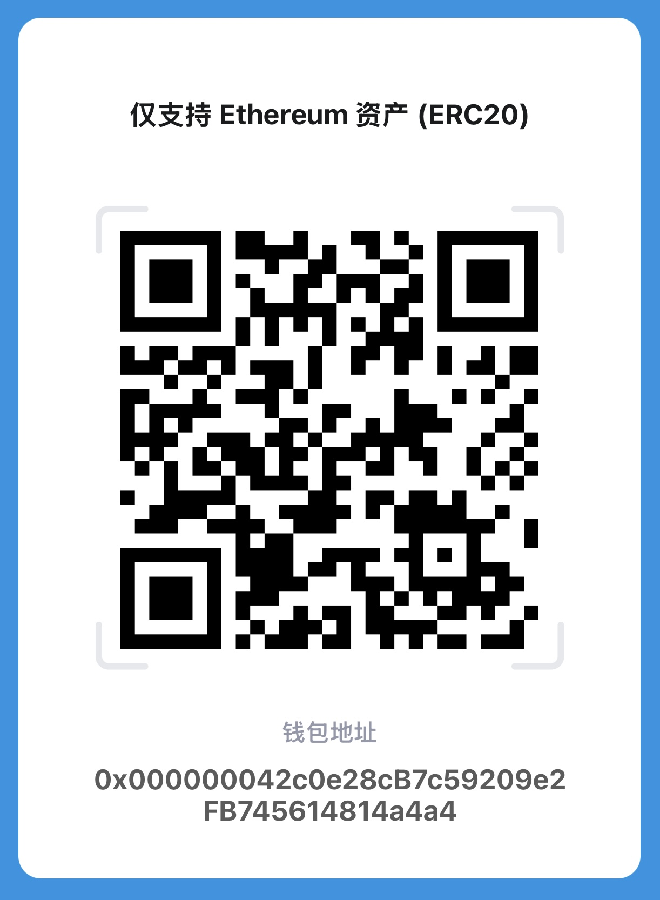
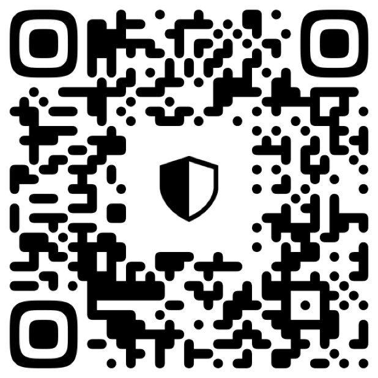

# 打赏支持

感谢您的支持！您可以通过以下方式进行打赏。本项目支持

1. [虚拟币](#1-加密货币打赏):   [EVM虚拟币](#evm-虚拟币-例如-eth-等网络ethereuml1l2-bsc-polygon-等) 、[比特币](#比特币-btc)、[Tron](#tron-trx-trc20)、[Solana](#solana-sol)
2. ~~支付宝~~和[微信支付](#微信)。

---

## 1. 加密货币打赏

### Tron (TRX, TRC20)

- **钱包地址：** `TKTQMEQds4MHpCzWRCdcD27Zs548888888`
- 
 
点击展开二维码

  
  

- **备注：** 请确保使用 Tron 网络进行转账。

### EVM 虚拟币 (例如 ETH 等)(网络：Ethereum(L1,L2), BSC, Polygon 等)

- **钱包地址：** `0x000000042c0e28cB7c59209e2FB745614814a4a4`
- **ENS:**  `4a4a4.eth` ,`frankie.science`,`yeatss.eth`
- 
 
点击展开二维码

  
  

- **备注：** 请确保您发送的是 EVM 网络支持的代币，如 ETH 或 ERC20 代币。

### 比特币 (BTC)

- **Lagacy 地址：** `13pMaWFd2sEgkGNLB7D1dyKSHpe6KfuEAW`
- **Taproot 地址：** `bc1p4yk3y5rusd54qmkk9jlc56dsrmemasryy0awkh5ldu0w948qg6hqr8wtwq`
- **备注：** 请确保您发送的是比特币。

### Solana (SOL)

- **钱包地址：** `D5jmHJfDW4UwgWFG8ZPEotLpjuNtSTxjdxGWnstAbTEi`
- 
 
点击展开二维码

  
  

- **备注：** 请确保您发送的是 Solana 网络支持的代币。

---

## 2. 法币支付

### 支付宝

- **支付二维码：**
  暂无

### 微信

- **赏赞码：**
  

---

## 3. 其他说明

- 转账前请务必确认您选择了正确的网络和货币种类，避免因网络错误导致资金损失。
- 如果遇到任何问题，请通过 [联系邮箱](mailto:frankie.fc.wang@outlook.com) 与我们联系。

再次感谢您的支持与打赏！
